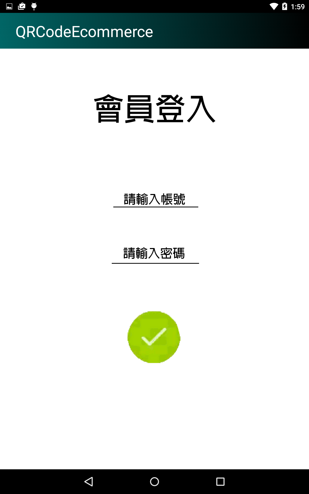
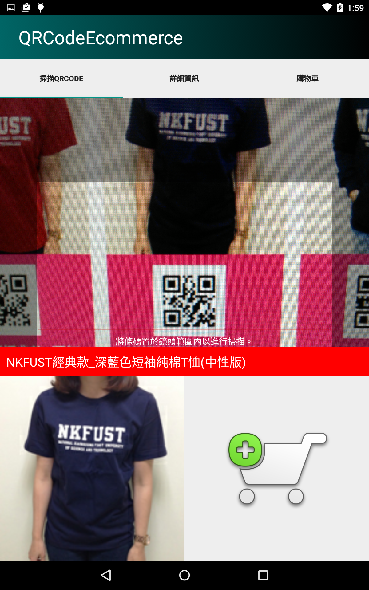
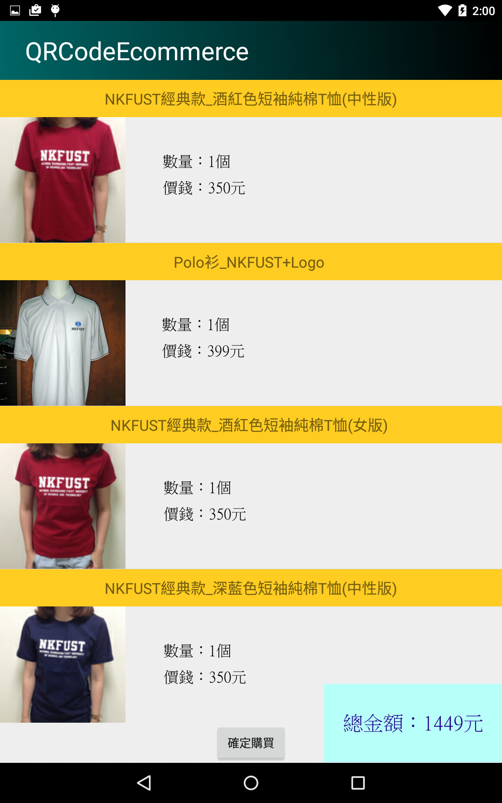

# QRCodeEcommerce

The app is a school-plan project built for student to buying and selling stuff.

Developed this app with Java and backend use PHP. I mainly developed the app part. I wrote some business logic for shopping, such as a shopping cart. Users can scan QRCode by our app to get product information and choose the quantity and style to add to the shopping cart to purchase. When backend received the order, it will be added to the database and the order will be successful created then use GCM push the order result for users.

